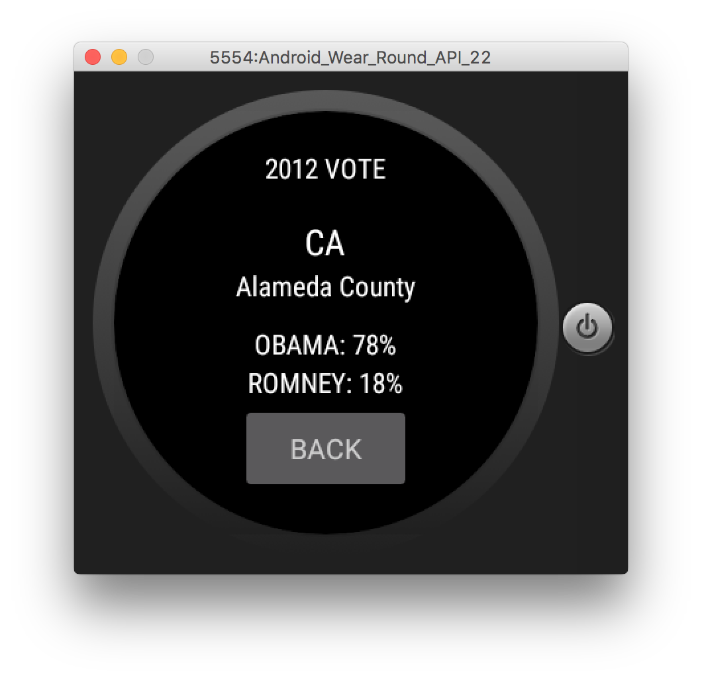

# PROG 02: Represent!

This app allows users to learn about the senators and congressional representatives in their local area and beyond.

## Authors

Casey Currey-Wilson ([currey-wilsonc@berkeley.edu](mailto:currey-wilsonc@berkeley.edu))

## Demo Video

See [CS 160 Prog 02C - Final Represent App] (https://youtu.be/u2hp5NhAmIE)

## Screenshots

## Acknowledgments

* https://piazza.com/class/ijddlu9pcyk1sk
* https://developers.google.com/maps/documentation/geocoding/intro#ReverseGeocoding
* http://stackoverflow.com/questions/6656258/access-fine-location-androidmanifest-permissions-not-being-granted
* https://docs.fabric.io/android/twitter/show-timelines.html
* http://www.androidauthority.com/use-remote-web-api-within-android-app-617869/
* https://drive.google.com/a/berkeley.edu/folderview?id=0BxnF-M5VYALIeGJLYjZzd0NvTDg&usp=sharing
* http://stackoverflow.com/questions/14798826/duplicate-views-on-android-during-run-time
* http://developer.android.com/intl/es/reference/packages.html
* http://stackoverflow.com/questions/4098198/adding-fling-gesture-to-an-image-view-android
* http://stackoverflow.com/questions/4139288/android-how-to-handle-right-to-left-swipe-gestures
* http://stackoverflow.com/questions/2317428/android-i-want-to-shake-it
